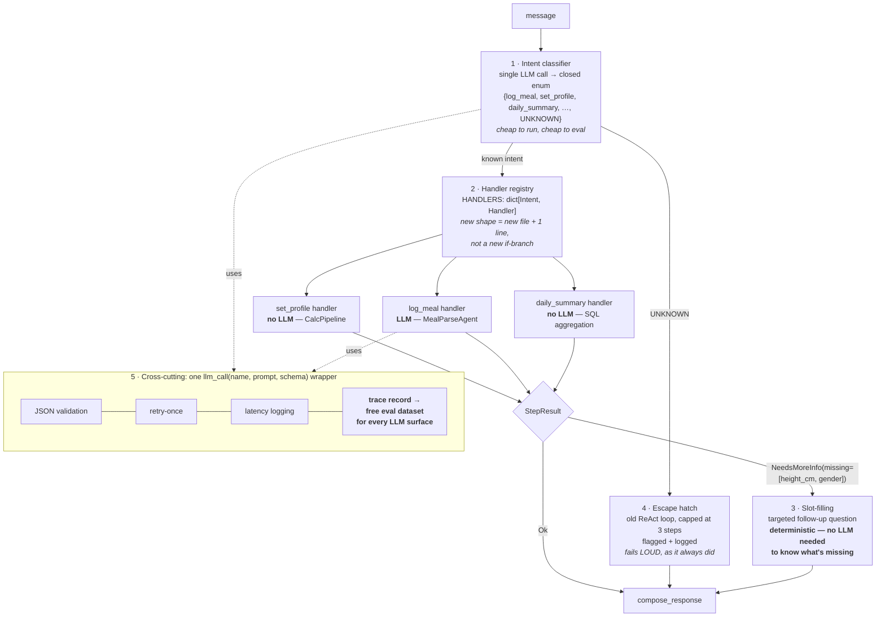

# Notes: Orchestrator vs. ReAct loop, for CalAI specifically

*Written 2026-08-02, after ADR-003 Action Items 2-7 landed (extraction, orchestrator rewrite, eval + latency comparison). This is an honest retrospective, not a sales pitch for the change I just helped ship — the old ReAct loop was kept in the codebase specifically so this comparison could be made fairly, and it stays there until you decide otherwise (ADR-003 Action Item 8, still open).*

> **Second pass, 2026-08-02:** a review section was appended at the end of this file
> ([Second-pass review](#second-pass-review-2026-08-02)) re-checking these claims against
> the code and the raw artefacts. It corrects one claim in this document, sharpens two,
> adds a code-level regression this retrospective missed, and proposes the target pattern.
> Where the two sections disagree, the review section is the later and better-evidenced read.

## The headline numbers, restated plainly

- **Speed:** orchestrator was 2.25x faster overall (179.04s vs 402.93s across 3 representative messages — see `artefacts/adr003-latency-comparison.json`). That's the biggest, least ambiguous win.
- **Accuracy on meal parsing:** identical — 83.6% item precision, 92.0% item recall, 59.3% calorie MAPE, both before and after, because `parse_meal_text`'s logic didn't change, only where it's called from did.
- **A real bug surfaced, not just latency:** the old loop's LLM-computed TDEE (3726 kcal) diverged sharply from the orchestrator's deterministic calculation (2678 kcal) on identical input. That's not a latency story — that's "the old design let a small local model quietly get arithmetic wrong," which is worse than slow.

## Advantages of the Orchestrator pattern, for this project specifically

1. **It removes the small model from doing math it was never good at.** `qwen2.5:3b` is a 3.1B-parameter model running locally. Asking it to also *sequence and execute* a fixed BMR→TDEE→calorie-goal calculation chain — instead of just parsing free text — was asking a weak model to do a job plain Python does perfectly and instantly. The TDEE divergence found in the latency comparison isn't a one-off fluke; it's the predictable failure mode of that design.
2. **Latency is no longer proportional to how many steps the model "decides" to take.** The ReAct loop's cost scaled with `MAX_STEPS` (up to 8) and how quickly the model converged on tool calls — unpredictable and, on this hardware/model combo, slow (up to 176s for one request in this comparison). The orchestrator's cost is now two bounded LLM calls (`extract_request_fields`, `parse_meal`) plus fixed-cost Python — bounded and predictable, which matters a lot when the whole stack is local-only with no GPU acceleration to fall back on.
3. **The routing decision genuinely was not ambiguous.** ADR-003's core bet was that "which tools to call" was fully determined by which fields are present in the request, not a judgment call. The eval parity result (identical scores before/after) is indirect confirmation of this: if the routing had actually needed reasoning, moving it out of the LLM's control would have degraded something. Nothing degraded.
4. **Debuggability.** A stack trace through `_run_agent_orchestrator` is three function calls. A stack trace through the ReAct loop is "the model chose to call X, then Y, for reasons implicit in 8 possible iterations of tool-call history." For a solo-maintained project, that difference matters more than it looks on paper.

## Disadvantages / honest costs of the Orchestrator pattern

1. **It's less general.** The ReAct loop, however slow, could in principle handle a request shape nobody anticipated — the model would just try tools until something worked (or it hit `MAX_STEPS` and failed loudly). The orchestrator only handles the shapes `extract_request_fields` was designed to extract (profile fields, meal text, meal type). A genuinely novel input shape — multi-turn clarification ("wait, I meant last night's dinner, not lunch"), or a request that mixes calorie tracking with something CalAI doesn't do yet — has no ReAct-style fallback anymore on the orchestrator path. This is the real tradeoff ADR-003 accepted, and it's a legitimate one to accept for a v1 with two known request shapes, but it's not free.
2. **`extract_request_fields` itself is unevaluated.** The ADR-004 eval harness scores `parse_meal_text`/`MealParseAgent` — it says nothing about whether `extract_request_fields` correctly turns free text into structured profile/meal fields. That's a second LLM call doing real interpretive work (parsing "I'm a 28 year old male... want to lose weight at 0.5kg/week" into typed fields) with zero accuracy measurement. The eval parity claim is honestly scoped to meal-parsing only — it would be overclaiming to say "the orchestrator is proven accurate," when only half of its two LLM calls have ever been measured.
3. **The latency comparison is a single run, not a distribution.** 3 messages, 1 run each per path (documented explicitly in `evals/latency_comparison.py`'s own docstring — this isn't hidden, but it bears repeating here). Real-world local-Ollama latency is known to vary with thermal state, other processes, and model warm/cold-start. 2.25x is a real, reproducible-shape win (the orchestrator structurally does less LLM work), but treating "2.25x" as a precise, stable multiplier rather than "meaningfully, probably 2-2.5x faster" would be reading more precision into one run than it supports.
4. **Two fixed LLM calls is still two LLM calls.** On a fast remote/GPU-backed model, the ReAct loop's flexibility-for-latency tradeoff would look different — the loop's variable step count would matter less if each step were fast. This win is somewhat specific to "local model, no GPU, every LLM round-trip is expensive," which is CalAI's actual situation, but worth remembering if that constraint changes.
5. **Confidence still isn't usable, and this change didn't touch that.** The 39.6% calibration score (below the 50% no-signal line) means the model's own `confidence` field is currently worse than useless for deciding what to trust — and nothing in the orchestrator rewrite fixed or even engaged with that. It's correctly *not* gated on (per ADR-003's explicit note), but it's also not solved. Anyone reading "orchestrator shipped" as "meal parsing got more trustworthy" would be wrong — only its performance and one bug shrank; its accuracy ceiling didn't move.

## Where the ReAct loop was actually fine (fairness check)

It's easy to write the loop's obituary uncharitably. Two things it did that are worth not losing:
- It required zero code changes to add a new "shape" of request — the system prompt was the only thing that needed updating. The orchestrator requires a new branch of Python for every new request shape. If CalAI's request variety grows fast, that's a real ongoing cost the orchestrator design took on.
- It's the simpler thing to explain in one sentence ("the LLM decides what to do"), even though the reality (unbounded latency, silent arithmetic errors) made that simplicity a bit of an illusion in practice. There's a version of this project where that illusion is actually fine — e.g., a prototype nobody's grading on latency or correctness yet. CalAI is past that point.

## What I'd change, if doing this again / next

1. **Evaluate `extract_request_fields`, not just `parse_meal_text`.** Build a small golden dataset (5-10 examples is enough to start) of free-text profile/meal messages → expected structured fields, and score it the same way ADR-004 scores meal parsing. Right now half the orchestrator's LLM surface area is unmeasured, which is exactly the gap ADR-004 was built to close for the *other* half.
2. **Turn the latency comparison into a light-weight repeatable check, not a one-off script.** Not a full statistical study — but 3 runs per message instead of 1, with median reported, would turn "2.25x, probably" into a number worth actually citing with confidence. `evals/latency_comparison.py`'s own docstring already anticipates this ("if the numbers are noisy, re-run... not... averaging logic") — I'd revisit that call once/if this number goes on a resume or gets compared against a future model swap.
3. **Give the orchestrator an explicit "I don't know what to do with this" path**, rather than silently mis-extracting when a message doesn't fit the two known shapes. Right now, an out-of-scope message likely gets forced through `extract_request_fields` and produces a plausible-looking but wrong structured result, with no signal that it should have been rejected or escalated. The old ReAct loop's failure mode (hit `MAX_STEPS`, error out) was slower but at least loud. This is the sharpest edge of Disadvantage #1 above and the one most worth closing before this design gets more request shapes piled onto it.
4. **Fix the confidence-calibration problem before building anything else on top of it** (persistence gating, low-confidence UI warnings, etc. — all things ADR-003's Decision section originally sketched and then explicitly deferred). Candidates worth trying: recalibrate the prompt's confidence instructions, try a larger local model for confidence specifically, or drop the field until there's a plan to fix it — currently it's dead weight that could mislead someone if they used it before checking the calibration score.
5. **Keep the old ReAct loop around longer than feels necessary.** It's tempting to call ADR-003 Action Item 8 (delete it) done as soon as parity is confirmed — but "parity on the metrics we happened to measure" isn't the same as "no cases where the more general fallback would have caught something the fixed-shape orchestrator missed." I'd want either (a) real production usage logged across a wider variety of inputs, or (b) the "I don't know what to do" path from point 3 built and tested, before removing the fallback for good.

## Bottom line

For CalAI as it exists today — two well-defined request shapes, a small local model, no GPU, a solo developer who needs predictable latency and debuggable failures more than open-ended flexibility — the Orchestrator pattern is the right call, and the numbers back it up honestly, not just narratively. The catch is that the win is somewhat specific to *this* project's constraints (small model, local-only, narrow request shapes), and the areas it didn't touch — `extract_request_fields`'s accuracy, confidence calibration, and graceful handling of out-of-scope input — are exactly where the next real risk is, not in the part that got measured and improved.

---
---

# Second-pass review (2026-08-02)

*Appended after re-reading `services/agent_service.py`, `evals/run_eval.py`, `schemas.py`,
and the raw `artefacts/adr003-latency-comparison.json` against the claims above. Everything
below is either a correction, a sharpening, or a new finding — the retrospective's overall
verdict (orchestrator was the right call) stands unchanged.*

> 🔍 **Expandable versions of every diagram in this section:** open
> [`artefacts/NOTES-orchestrator-vs-react-diagrams.html`](./NOTES-orchestrator-vs-react-diagrams.html)
> in a browser. Click **⤢ Expand** (or double-click a diagram) for fullscreen — scroll to zoom,
> drag to pan, `0` to reset, `Esc` to close. Same three diagrams, rendered and zoomable.

## What the two paths actually look like

```
  ═══ OLD: ReAct loop (_run_agent_react_loop, USE_ORCHESTRATOR=false) ═══

     message ──► [ LLM + all tools bound ] ◄──────────────┐
                        │                                  │
                        │ model picks a tool               │ ToolMessage
                        ▼                                  │ appended to
                 calculate_bmr / calculate_tdee /          │ history,
                 calculate_calorie_goal / parse_meal_text ─┘ loop again
                        │
                        │  (up to MAX_STEPS=8 round-trips; context grows
                        │   every iteration; model both SEQUENCES and,
                        │   observed in practice, RE-DERIVES arithmetic)
                        ▼
                 final answer  ── or ── HTTP 500 "max iterations reached"

     LLM calls: 1..8 (unbounded within cap)     Failure mode: slow, but LOUD


  ═══ NEW: Orchestrator (_run_agent_orchestrator, default) ═══

     message
        │
        ▼
   ┌──────────────────────────┐
   │ extract_request_fields   │  ← LLM call #1 (JSON mode, single-shot)
   │   free text → ParsedRequest │   *** UNEVALUATED ***
   └──────────┬───────────────┘
              │
      ┌───────┴────────┐
      │                │
  profile?         meal_text?
  (ALL 6 fields)        │
      │                 ▼
      ▼          ┌──────────────┐
 ┌─────────────┐ │ parse_meal   │  ← LLM call #2
 │ CalcPipeline│ │ (MealParse-  │    *** the ONLY evaluated surface ***
 │ pure Python │ │  Agent)      │
 │ bmr→tdee→   │ └──────┬───────┘
 │ goal        │        │
 └──────┬──────┘        │
        └───────┬───────┘
                ▼
         compose_response()
                │
                ▼
          AgentResponse
                │
       (neither ran → generic "tell me your weight, height, age…" fallback)

     LLM calls: exactly 2 (or 1)     Failure mode: fast, but SILENT
```

The diagram makes the real trade visible: the old path's failure was *loud and slow*
(`HTTP 500: max iterations`), the new path's failure is *fast and silent* (a plausible-looking
answer, or a generic re-ask). That is the whole of Disadvantage #1 above, drawn.

## Corrections and sharpenings to the sections above

**1. CORRECTION — Disadvantage #3 is too cautious about the 2.25x.** The retrospective says
treating 2.25x as a stable multiplier "would be reading more precision into one run than it
supports." That's over-hedged. Looking at the per-message rows in
`artefacts/adr003-latency-comparison.json` rather than only the total:

| message | react_loop | orchestrator | speedup |
|---|---|---|---|
| profile_only | 76.60s | 31.85s | **2.41x** |
| meal_only | 150.29s | 73.20s | **2.05x** |
| profile_and_meal | 176.04s | 73.99s | **2.38x** |

Three independent messages of different shapes all landed in a 2.05-2.41x band. That is a
*much* stronger result than "2.25x across a total," because the aggregate could in principle
have been carried by one `MAX_STEPS`-capped outlier — and it demonstrably wasn't. The honest
statement is "consistently ~2x, measured at 2.05-2.41x across three request shapes, n=1 each,"
not "probably 2-2.5x." Recommendation 2 above (run it 3x and take a median) is still worth
doing, but it is now a nice-to-have, not a caveat the claim depends on.

**2. SHARPENING — the TDEE divergence is the headline, not a bonus finding.** Both this
document and ADR-003 Action Item 7 file the 3726-vs-2678 kcal divergence as a "bonus."
It is the actual argument. Latency is a hardware/model problem — a faster machine erases
a 2.25x gap. "A 3B model silently produced a ~39% wrong calorie goal, in a calorie-tracking
app, and nothing in the system would have caught it" is not erasable by better hardware; it
is a property of letting the model do arithmetic it was only meant to sequence. **Also: this
bug is currently unguarded.** It was found by accident in an n=1 latency script; there is no
test asserting that the `profile_only` message yields TDEE 2678. That should be a permanent
regression case (owner: `tester`) — otherwise the single most persuasive result of ADR-003
lives only in a JSON artefact and a paragraph.

**3. SHARPENING — the eval-parity claim is weaker than Disadvantage #2 states, and for a
different reason.** The retrospective says `extract_request_fields` is simply "unevaluated."
The sharper problem, confirmed in `evals/run_eval.py::run_example`, is that the harness calls
`parse_meal_text(example["input"], meal_type)` — it feeds **golden** meal text straight in,
bypassing `extract_request_fields` entirely. So on the orchestrator path there is now a lossy
LLM step sitting *upstream of, and inside the data path of,* the only thing being measured:

```
   EVAL PATH:        golden meal_text ─────────────────► parse_meal ──► scored ✓
   PRODUCTION PATH:  message ─► extract_request_fields ─► parse_meal ──► NOT scored ✗
                                 └── re-worded / lossy ──┘
```

"Exact parity" therefore means *"the component didn't change"* — which is true, useful, and
exactly what a refactor-safety check should show. It does **not** mean end-to-end meal-parsing
accuracy held, because the input distribution `parse_meal` sees in production changed. It could
be better or worse; nobody has measured it. Recommendation 1 above (evaluate
`extract_request_fields`) is right, and this is the reason it's the top priority rather than
a completeness nicety.

**4. NEW FINDING — a real UX regression shipped alongside the win.** In
`extract_request_fields`, `profile` is populated only when *all six* required `CalcRequest`
fields are present; otherwise it is silently `None` and every extracted field is discarded:

```python
required_present = all(profile_fields[k] is not None for k in _PROFILE_FIELD_NAMES if k != "goal_rate_kg_per_week")
if required_present:
    profile = CalcRequest(**kwargs)
# else: profile stays None — the 4 fields the model DID extract are thrown away
```

So *"I'm 28, 70kg, trying to lose weight"* extracts four valid fields, drops all of them, and
`compose_response` returns the catch-all *"Could you tell me your weight, height, age, gender,
activity level, and goal…"* — asking the user for things they just said. The old ReAct loop
would at least have had a shot at a targeted follow-up. This is the same root cause as
Recommendation 3 above ("give the orchestrator an explicit 'I don't know' path"): the
orchestrator has exactly one all-or-nothing branch per capability and no vocabulary for
*partially* satisfied. Worth noting this is a **behaviour change not covered by any eval or
test** — the eval harness only scores meal parsing, so nothing flagged it.

**5. NEW FINDING (minor) — `iterations_used` now lies.** The orchestrator sets it to
`sum(1 for step in (calc, meal) if step is not None)` — 0, 1, or 2 — with an honest code
comment explaining the reinterpretation. But it is still the same field, same name, in the
same `AgentResponse` contract that Flutter consumes, and it no longer means "iterations."
Either rename it (contract change, needs `flutter-engineer`) or document it as deprecated at
the schema level. Silently redefining a field's meaning while keeping its name is the kind of
thing that costs an hour of debugging six months later.

## The pattern I'd recommend scaling to

Not "more agents." The generalisation of what ADR-003 already got right is
**router → typed capability handlers, with a bounded agent as the escape hatch.**
This keeps every property ADR-003 bought (deterministic core, bounded latency, one evaluable
LLM surface per job) while removing its two structural weaknesses (no "I don't know" path;
one new Python branch per request shape).



Five components, in the order I'd build them:

1. **Intent classifier** — one cheap structured call returning a *closed enum* plus an explicit
   `UNKNOWN`. Enums are trivially evaluable (accuracy over ~30 labelled messages) and give the
   system somewhere for "I don't know what this is" to live — the gap Recommendation 3 names.
2. **Handler registry, not an if-chain** — `HANDLERS: dict[Intent, Callable[[Request], StepResult]]`.
   This answers the fairest criticism in "Where the ReAct loop was actually fine": adding a
   request shape becomes a new file plus one registration line, not surgery on the orchestrator.
   Deterministic handlers stay plain functions; only handlers that genuinely *interpret* get an LLM.
3. **Slot-filling instead of multi-turn ReAct** — handlers return `NeedsMoreInfo(missing=[...])`
   rather than falling through to a generic re-ask. Fixes finding #4 above, and it's the
   multi-turn story without reintroducing an unbounded loop: knowing *which* fields are absent
   is an `if`, not a reasoning task.
4. **Demote the ReAct loop to fallback — do not delete it.** This is the recommendation I'd push
   hardest, and it directly supersedes **ADR-003 Action Item 8**. Route `intent=UNKNOWN` into the
   old loop, capped at ~3 steps, behind a flag, logged. It stops being working-code-you're-nervous-
   about-deleting and becomes the graceful-degradation path the orchestrator structurally lacks.
   That converts Disadvantage #1 from a hard ceiling into a bounded, measurable cost — and it is a
   better resolution of Recommendation 5 ("keep it around longer than feels necessary") than
   indefinitely deferring a deletion.
5. **One `llm_call(name, prompt, schema)` wrapper.** `extract_request_fields` and
   `meal_parse_agent.parse_meal` currently hand-roll the same JSON parsing, validation, and
   latency logging. Unify them, and have the wrapper emit a trace record — which produces an eval
   dataset for *every* LLM surface for free. That is the systematic fix for "half the orchestrator
   is unmeasured," rather than hand-building a golden set per surface forever.

**Explicitly not recommended:** LLM supervisor, message bus, async job queue, agent-to-agent chat.
At ~0.17 RPS peak (`SYSTEM-DESIGN-1000-USERS.md`) on a local 3B model, all of it is cost with no
payoff. ADR-003's rejection of Option B was correct and the reasoning still holds — this proposal
keeps routing deterministic, it just gives routing an enum and a fallback instead of an
all-or-nothing field check.

**Sequencing by value-per-effort:** `llm_call` wrapper + traces → intent enum with `UNKNOWN` →
slot-filling → handler registry → ReAct-as-fallback. Extraction evals come free once traces exist,
which closes the #3 sharpening above without a separate dataset-building project.

## Expected impact of the proposed pattern — predictions, made before the work

*Written up front deliberately. A latency claim is only worth something if it was stated before
the change and then checked against a measurement, rather than reverse-justified after. Every
number in this section is an **estimate with n=0** unless it links to `adr003-latency-comparison.json`.*

### First: the current system decomposes cleanly, and that's a result in itself

Reading the per-message rows of `artefacts/adr003-latency-comparison.json` as a system of equations:

| message | measured | LLM calls that fired | implies |
|---|---|---|---|
| profile_only | 31.85s | extract only (CalcPipeline is pure Python, ~0ms) | `extract_request_fields` ≈ **31.9s** |
| meal_only | 73.20s | extract + parse_meal | `parse_meal` ≈ **41.4s** |
| profile_and_meal | 73.99s | extract + calc + parse_meal | predicted 31.9 + 41.4 = **73.2s** vs **73.99s** measured |

**The predicted and measured both-case agree to within ~1%.** That is the bounded-latency claim
in ADR-003's Consequences section confirmed empirically, not just argued: total latency is now
`(number of LLM calls that fired) × (their individual costs)`, with no loop variance term. It
also means future latency estimates for this architecture are arithmetic rather than guesswork —
which is what makes the predictions below checkable rather than vibes.

### Predictions

| dimension | prediction | confidence |
|---|---|---|
| per-request latency, profile path | **flat**, ~32s | high — same one LLM call |
| per-request latency, meal path | **~1.8x better** (73.2s → ~41s), *if* the redundant extraction is dropped | medium — depends on the change below |
| LLM calls per request | 1-2, **unchanged** — but now provably bounded for out-of-scope input too | high |
| per-task latency on partial input | **~2x better** (two round trips → one + a cheap follow-up) | medium |
| meal-parse accuracy | **unknown, plausibly better** — `parse_meal` would see the user's real words | low — must be measured, not assumed |
| correctness / extensibility | the actual reason to do this | — |

### Why the honest headline is "flat latency"

A naive reading of the proposal makes things *worse*: an intent classifier is a third LLM call,
which on this hardware is ~30s added to every request. So **don't add one as a separate call —
merge the intent enum into the existing `extract_request_fields` schema as one additional field.**
Same call, approximately the same output tokens, and the `UNKNOWN` path comes for free.
Expected delta: **0%, within noise.**

This design is bought for correctness, an explicit "I don't know" path, and cheap extensibility.
Latency is a side effect, not the argument. Anyone presenting it as a performance win is
overselling it — ADR-003 was the performance win (2.05-2.41x, measured); this is the correctness
and generality follow-up.

### The one place correctness and latency point the same way

> When `intent == log_meal`, **skip extraction entirely** and hand the *raw message* to `parse_meal`.

Today the meal path pays ~32s for an LLM call whose job is to produce a `meal_text` string that is
then re-read by a second LLM. That is both the biggest single cost on the meal path and the exact
lossy step identified in sharpening #3 above. Removing it:

- meal_only: **73.2s → ~41s (≈1.8x)**, i.e. **≈3.7x vs. the original ReAct loop's 150.29s**
- `parse_meal` receives the user's original wording, so the eval path and the production path
  converge — which closes the "exact parity proves less than it sounds" gap *structurally*,
  rather than by building a second golden dataset

This is the highest value-per-effort item in the whole proposal and should be measured first.

### Where the real order-of-magnitude actually is (and it isn't here)

If raw speed is the goal, none of the above is where to look. On a 3B model on CPU, latency is
dominated by serving configuration:

- **Ollama `keep_alive`** — cold model load plausibly accounts for a large share of the ~32s
  floor. Config-only change, costs nothing to test.
- **`num_predict` cap + a tighter per-intent output schema** — generation length dominates on CPU,
  and the current extraction call emits all ~9 nullable fields on every request regardless of
  intent. A per-intent schema emits 2-3.
- **`config.py` still defaults `MODEL_NAME` to `qwen2.5:7b`** while only `qwen2.5:3b` is actually
  pulled on the reachable Ollama instance. Every number in this document is a 3b number; if that
  default ever resolves, expect roughly 2x worse across the board. Pin it to what actually runs.

### How to check these predictions

`evals/latency_comparison.py` already does exactly the right thing and just needs a third path
added alongside `react_loop` and `orchestrator`. Run the same 3 messages, ideally 3 runs each
taking the median (Recommendation 2 above), and record the result next to
`adr003-latency-comparison.json` so this section can be marked right or wrong rather than quietly
forgotten. **If the meal path does not come in meaningfully under ~50s, the skip-extraction change
did not do what this section claims and the reasoning above should be revisited, not the numbers
re-explained.**

## Revised bottom line

Unchanged verdict, changed emphasis. The orchestrator was the right call and the evidence is
better than this document originally claimed (per-message consistency, not just an aggregate).
But the win should be stated as **"removed a class of silent arithmetic error, and got ~2x faster
doing it"** — in that order. The remaining risk is entirely in what the split *added* and left
unmeasured: a lossy extraction step upstream of the only evaluated component, an all-or-nothing
profile check that discards partial input, and no path for a message that fits neither shape.
The pattern above is the smallest set of changes that closes all three without adding an agent
that isn't earning its latency.
